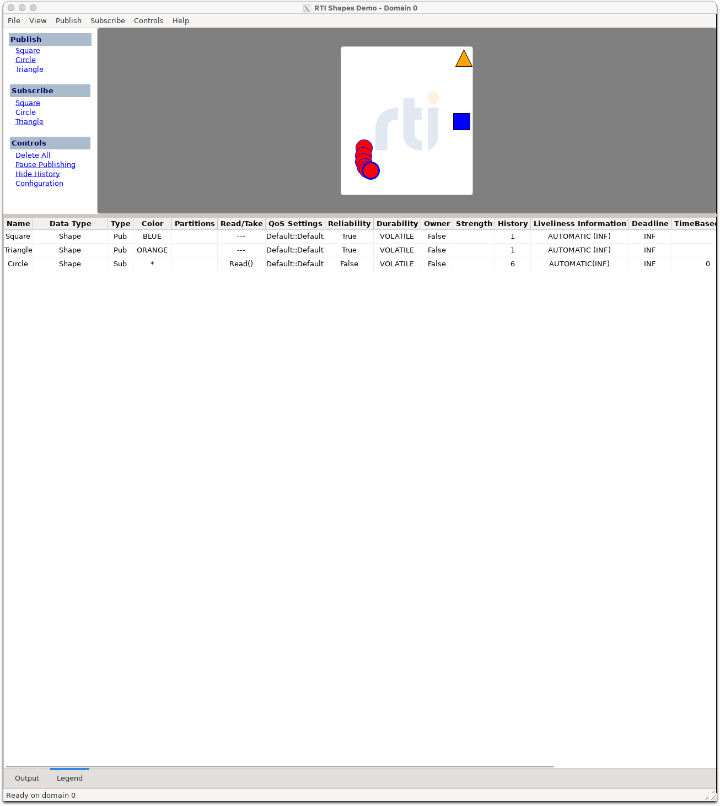

# Cross-Vendor Shapes Demo — Setup Guide

Der **DDS Shapes Demo** ist der kanonische Cross-Vendor-Interop-Test in
der DDS-Welt: drei Topics (`Square` / `Circle` / `Triangle`), ein
gemeinsamer Type (`ShapeType`), beliebige Pub/Sub-Konstellationen
zwischen verschiedenen Vendoren. Wenn deine Shapes auf RTIs Canvas
auftauchen, hast du DDS-Wire-Compliance bewiesen.

Diese Anleitung zeigt, wie du **ZeroDDS** gegen die GUI-Demo-Tools von
**RTI Connext**, **Cyclone DDS** und **FastDDS** im laufenden Betrieb
testest.

> Beispiel-Run (RTI Shapes Demo rendert ZeroDDS-publizierte Circles):
>
> 
>
> Die roten Circles im Canvas kommen vom ZeroDDS-Publisher auf llvm,
> die blauen Squares vom RTI Shapes Demo selbst. Beide Stacks teilen
> sich Domain 0 via UDP-Multicast-Discovery.

---

## Inhalt

1. [Voraussetzungen](#voraussetzungen)
2. [Quick-Start ZeroDDS ↔ RTI](#quick-start-zerodds--rti)
3. [Quick-Start ZeroDDS ↔ Cyclone DDS](#quick-start-zerodds--cyclone-dds)
4. [Quick-Start ZeroDDS ↔ FastDDS](#quick-start-zerodds--fastdds)
5. [Wire-Format-Resolution (XCDR1/XCDR2)](#wire-format-resolution-xcdr1--xcdr2)
6. [Troubleshooting](#troubleshooting)
7. [User-facing Bundle](#user-facing-bundle)

---

## Voraussetzungen

### Linux + ZeroDDS-Build

```bash
git clone https://gitlab.sandra-kessler.eu/zerodds/zerodds.git
cd zerodds
rustup toolchain install 1.88.0
cargo build --release -p zerodds-dcps --example shapes_demo_publisher
cargo build --release -p zerodds-dcps --example shapes_demo_subscriber
```

Binaries liegen dann in `target/release/examples/`.

### Mindestens einer der Vendor-Demo-Tools

| Vendor | Tool | Bezugsquelle |
|---|---|---|
| RTI | `rtishapesdemo` (GUI) | [rti.com Shapes Demo Download](https://www.rti.com/free-trial/shapes-demo) — kostenlos für non-production |
| Cyclone DDS | `cyclonedds shapes` (CLI) | apt: `cyclonedds-tools` (Debian/Ubuntu) |
| FastDDS | `ShapesDemo` (Java GUI) | [eProsima/ShapesDemo](https://github.com/eProsima/ShapesDemo) — github releases |

Alle drei sind freely available für Demo/Test/Research-Use.

### macOS / X11-Forward (optional)

Falls die Demo-GUI auf einem Linux-Host läuft (z.B. Server) aber du auf
einem Mac arbeitest:

```bash
# Mac:
open -a XQuartz                                # XQuartz starten
ssh -X user@host /opt/rti.com/.../rtishapesdemo &  # GUI über X11-forward
```

---

## Quick-Start ZeroDDS ↔ RTI

### Schritt 1 — RTI Shapes Demo starten

```bash
# RTI Shapes Demo mit Standard-Type (NICHT ShapeExtended) auf Domain 0:
/opt/rti.com/rti_connext_dds-7.7.0/bin/rtishapesdemo \
    -domainId 0 \
    -dataType Shape
```

**Wichtig**: Default-Aufruf öffnet `ShapeExtended`-Type — der ist
**nicht** kompatibel mit `Shape` von ZeroDDS/Cyclone/FastDDS. Immer
`-dataType Shape` mitgeben.

In der RTI-GUI:
1. Klick **Subscribe → Circle** (ZeroDDS sendet Circle in Schritt 2)
2. Optional: **Publish → Square (BLUE)** — RTI publisht selbst Squares

### Schritt 2 — ZeroDDS-Publisher starten

```bash
# Auf demselben Host wie RTI Shapes Demo:
target/release/examples/shapes_demo_publisher Circle RED 0
#                                              │     │   │
#                                              Topic Color Domain
```

Erwartete Output:
```
shapes_demo_publisher: Topic=Circle Color=RED Domain=0 — Ctrl-C to stop
matched subscriber found, starting publication
  -> color=RED x=120 y=225 size=30
  -> color=RED x=131 y=223 size=30
  ...
```

**Erfolg**: im RTI-Demo-Canvas erscheinen rote Circles, die wandern.

### Schritt 3 (optional) — ZeroDDS-Subscriber rendert RTI-Shapes

```bash
target/release/examples/shapes_demo_subscriber Square 0
```

Druckt RTI-publizierte Square-Positionen auf stdout.

---

## Quick-Start ZeroDDS ↔ Cyclone DDS

Cyclone-Tools haben ein leichtgewichtiges Python-CLI ohne GUI. Wir
nutzen `cyclonedds shapes` (Teil des `cyclonedds-tools`-Pakets).

### Schritt 1 — Cyclone Subscriber

```bash
# Cyclone subscribe Circle, Domain 0
cyclonedds shapes -d 0 subscribe Circle
```

### Schritt 2 — ZeroDDS Publisher

```bash
target/release/examples/shapes_demo_publisher Circle BLUE 0
```

Cyclone-CLI druckt empfangene Samples auf stdout. Für GUI-Render
brauchst du den FastDDS-ShapesDemo (matchet auch Cyclone-Wire).

---

## Quick-Start ZeroDDS ↔ FastDDS

eProsimas Java-basiertes ShapesDemo:

### Schritt 1 — FastDDS ShapesDemo

```bash
# Download von github.com/eProsima/ShapesDemo
java -jar ShapesDemo-3.6.1.jar
# In GUI: Configure → Domain 0; Subscribe Circle
```

### Schritt 2 — ZeroDDS Publisher

```bash
target/release/examples/shapes_demo_publisher Circle GREEN 0
```

---

## Wire-Format-Resolution (XCDR1 / XCDR2)

Der DDS-Standard erlaubt zwei Encodings:

| Encoding | Encap-Header | Standard-Stack-Default |
|---|---|---|
| XCDR1 (`PLAIN_CDR_LE`) | `0x00 0x01 0x00 0x00` | RTI Shapes Demo (legacy) |
| XCDR2 (`PLAIN_CDR2_LE`) | `0x00 0x07 0x00 0x00` | Cyclone, FastDDS modern |

**ZeroDDS-Default**: announct `[XCDR1, XCDR2]` (`XCDR1` first für
RTI-strict-Compat). Negotiation pro Reader-Proxy via
`data_representation::negotiate(...)`. Wire-Encap wird in
`adapt_payload_for_proxy` per-Reader-Proxy gesetzt.

### Per-Application-Override

Globaler Default (`RuntimeConfig`):

```rust
use zerodds_dcps::runtime::RuntimeConfig;
use zerodds_rtps::publication_data::data_representation::{
    DataRepMatchMode, XCDR2,
};

let cfg = RuntimeConfig {
    data_representation_offer: vec![XCDR2],          // XCDR2-only
    data_rep_match_mode: DataRepMatchMode::Strict,   // Spec-strict
    ..RuntimeConfig::default()
};
```

Per-Writer/Reader-Override (`UserWriterConfig`/`UserReaderConfig`):

```rust
let writer_cfg = UserWriterConfig {
    // ...
    data_representation_offer: Some(vec![XCDR2, XCDR]),  // Per-Writer
};
```

### Match-Modes

* **Strict** (XTypes 1.3 §7.6.3.1.2 normativ): `writer.first ∈ reader.list`
* **Tolerant** (Industry-Norm): `any-overlap`, picks first-overlap.
  Cyclone DDS und FastDDS verhalten sich tolerant.

---

## Troubleshooting

### "no subscriber matched in 10s"

→ Type-Name oder Topic-Name mismatched, oder DataRep-Lists überlappen
nicht.

**Diagnose**: pcap aufnehmen während ZeroDDS-Pub gestartet wird:

```bash
sudo tcpdump -i any -w /tmp/dds.pcap "udp and (portrange 7400-7500 or host 239.255.0.1)" &
target/release/examples/shapes_demo_publisher Circle RED 0
# nach 10s pkill tcpdump
```

In Wireshark öffnen, RTPS-Filter `rtps and rtps.sm.id == 0x15`. Vergleiche
ZeroDDS' DATA(w) mit RTI's DATA(r):
- `PID_TOPIC_NAME` muss identisch sein
- `PID_TYPE_NAME` muss identisch sein (`ShapeType` für Standard-Shape,
  nicht `ShapeExtendedType`)
- `PID_DATA_REPRESENTATION` muss überlappen (siehe oben)

### RTI subscriber bleibt leer obwohl Match-Status = matched

→ Wire-Encap falsch. ZeroDDS announct DataRep-X, sendet aber DataRep-Y
auf Wire (Inkonsistenz).

**Diagnose**: in pcap die DATA-Submessage-Encap-Bytes auf Frame mit
`writerEntityId == 0x00000102` (User-Writer) prüfen. Erste 2 Bytes der
Payload nach RTPS-Header müssen zur announced DataRep passen.

### RTI Shapes Demo zeigt Data Type "Shape Extended"

→ falsch gestartet. RTI-Default ist Extended. Restart mit
`-dataType Shape`. Siehe oben.

### Mac-Side rendert nicht (X11-Forward)

→ XQuartz nicht gestartet (`open -a XQuartz`), oder SSH ohne `-X`/`-Y`
Flag verbunden.

```bash
# Test SSH-X11:
ssh -X user@host xclock      # sollte Clock-Window auf Mac öffnen
```

---

## User-facing Bundle

Im Repo unter `examples/demos/shapes/` liegt ein User-friendly Bundle:

```
examples/demos/shapes/
├── README.md           — User-facing Quickstart
├── run-shapes.sh       — Convenience-Script (build + run)
└── docker-compose.yml  — Containerized Cyclone+FastDDS
```

Siehe `examples/demos/shapes/README.md` für Bundle-Quickstart.

---

## Spec-Konformanz

Die ZeroDDS-Shapes-Implementation ist konform zu:

* **DDS 1.4** §2.2.3 (Topic, DataReader, DataWriter)
* **DDSI-RTPS 2.5** §8.5 (SEDP), §10.5 (Data-Encapsulation)
* **DDS-XTypes 1.3** §7.6.3.1 (DataRepresentationQosPolicy)
* **OMG ShapesDemo IDL** (kanonisches Test-IDL der OMG-DDS-Suite)

Wire-Compliance-Tests in `crates/dcps/tests/shapes_type_wire.rs`:
byte-genaue Encoding-Roundtrips gegen XCDR1- und XCDR2-LE-Referenzen.
